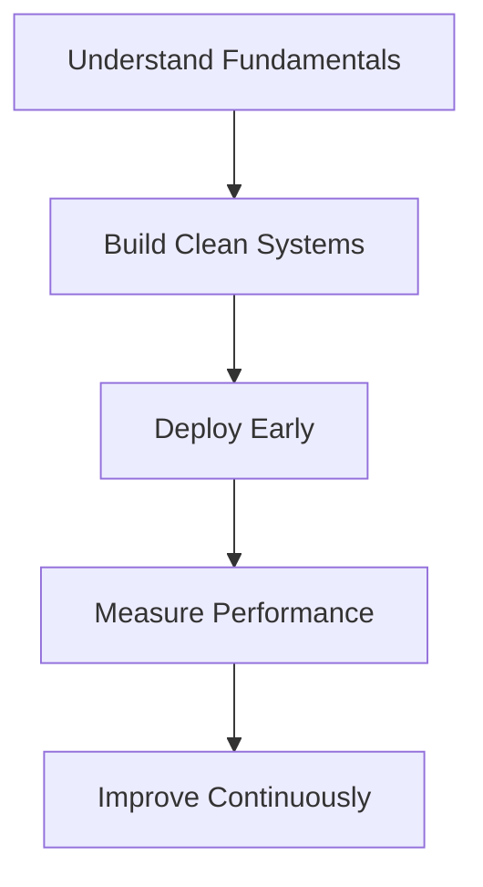

# Hi there 👋  , I'm **Md Tarik Anvar** 

  

---

### 🎓 Final-Year B.Tech CSE • Software Development Engineer • MERN Developer •GEN AI Engineer

**“Build systems that work. Then make them better.”**

Passionate about clean architecture, scalable backend systems, and practical AI integration.

---

# 🌐 Connect With Me

---

# 📊 GitHub Stats & Analytics

  
  
  

 

  

 

  

---

# 🛠️ Tech Stack

## 💻 Languages & Core

  

---

## 🌐 Full-Stack Development

  

---

## 🤖 AI & Data Tools

  

---

## ⚙️ DevOps & Deployment

  

---

# 🚀 What I Build

### 🔹 Full MERN Applications
- REST APIs with authentication (JWT, OAuth)
- Secure backend architecture
- Database schema design
- Deployment on Vercel & Render
- Production-ready routing & middleware

### 🔹 Practical AI Integration
- ML model APIs using FastAPI / Flask
- Computer vision pipelines (OpenCV, PyTorch)
- Data analysis dashboards
- GPU-accelerated experimentation

### 🔹 Core Engineering Focus
- Clean code & modular structure  
- Performance optimization  
- DSA & system design fundamentals  
- Real-world deployable systems  

---

# 🎯 Current Focus

- Strengthening Software Engineering fundamentals  
- Building strong deployable MERN projects  
- Preparing for SDE roles  
- Integrating AI features where they add real product value  

---

# 💡 Engineering Philosophy

Systems are not magic. They are logic stacked carefully.
# 🤝 Open To

- Full-stack collaborations  
- Backend architecture discussions  
- Practical AI product development  
- Open-source contributions  

---

### ⭐ If you find my projects useful, consider giving them a star.

**Let’s build software that actually works.**

